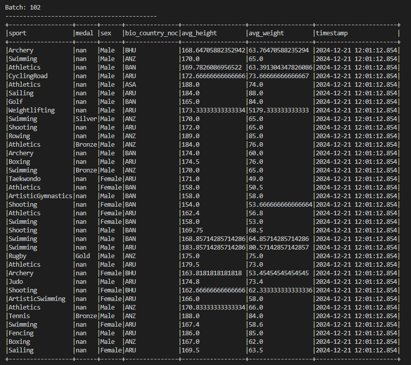
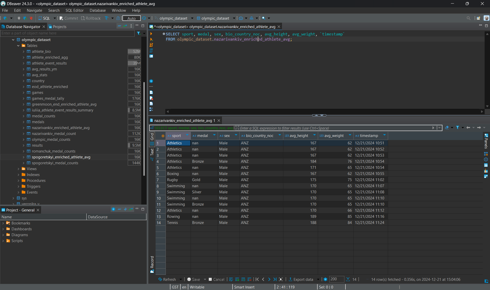
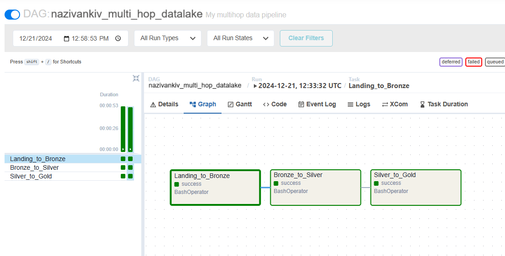
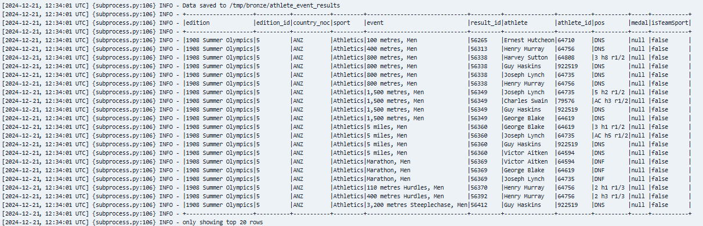
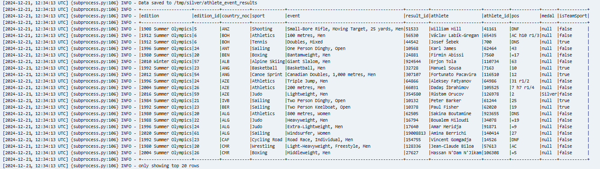
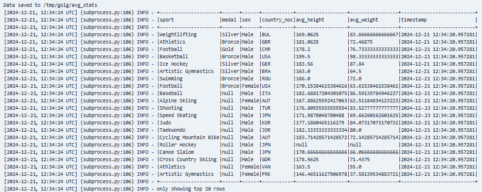

# Final project

# 1. Building an End-to-End Streaming Pipeline
**1.1 Kafka:**
  
**1.2. DB:**
  

# 2. Building an End-to-End Batch Data Lake
**2.1 Graph:**
  
**2.2. LANDING to BRONZE:**
  
**2.3 BRONZE to SILVER:**
  
**2.4. SILVER to GOLD:**
  
